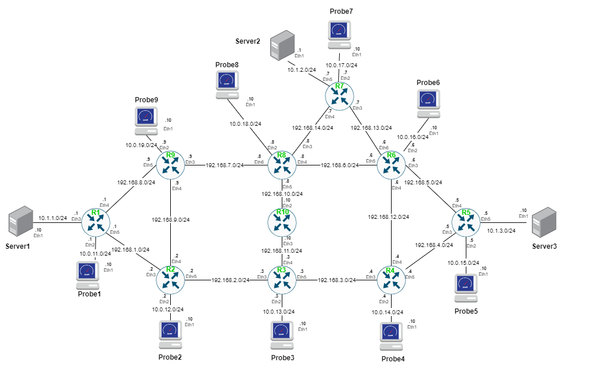
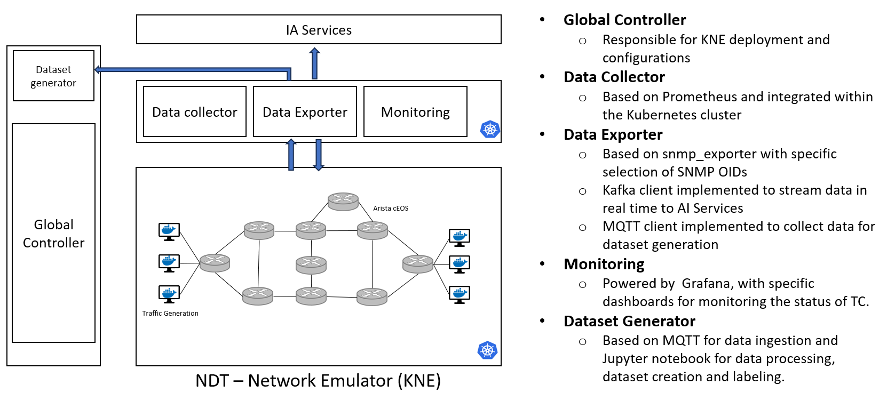
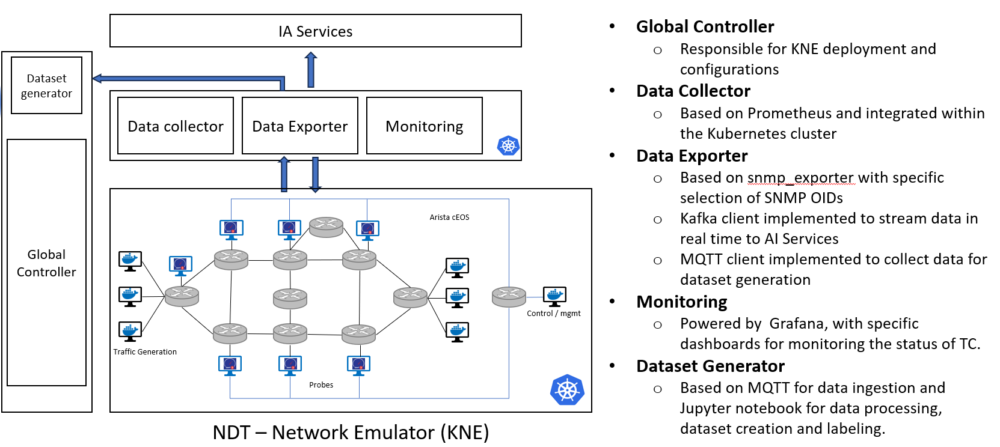
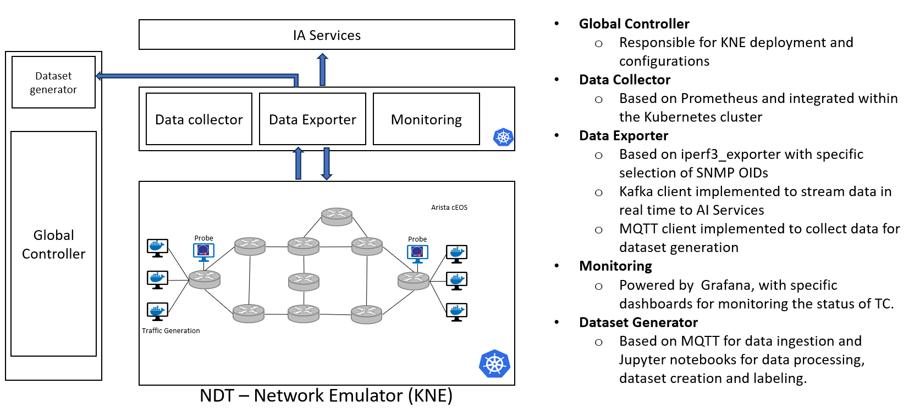

# ACROSS

An example of how to create a topology using the `new_scenario_ceos_tc.yaml` descriptor is shown below:



Scenario for TC3.1, TC3.3 &amp; TC3.4

- TC3.1 Anticipatory Detection, Analysis, & Prevention of Congestion Problems
  
- TC3.3 Smart QoS-aware Zero-Touch Traffic Engineering
  
- TC3.4 Intelligent Zero-Touch SLA Preservation
  

Outcomes

- Datasets for TC3.1 Anticipatory Detection, Analysis, & Prevention of Congestion Problems
https://zenodo.org/records/17255272

- Datasets for TC3.3 Smart QoS-aware Zero-Touch Traffic Engineering
https://zenodo.org/records/17255307

- Datasets for TC3.4 Intelligent Zero-Touch SLA Preservation
https://zenodo.org/records/17255327


Example of use:
- Create the 10 routers csr topology:
   
```bash
kne create kne/examples/TC3.X_new_scenario/new_scenario.yaml
```

- Delete the scenario:
```bash
kne delete  kne/examples/TC3.X_new_scenario/new_scenario.yamlcisco/13csr_RSTI/13csr.yaml
```

- See the status of the pods:
```bash
kubectl get pods -A -o wide -w
```

Once the topology has been successfully deloyed, the device created with vrnetlab can be accessed with the default credentials, corresponding to the user and password, "vrnetlab" and "VR-netlab9" respectively and its external IP address.

- Identify the External-IP: 

```bash
root@k8-controller:~# kubectl get services -n 10-ceos-v3
NAME                 TYPE           CLUSTER-IP       EXTERNAL-IP   PORT(S)        AGE
service-broker       LoadBalancer   10.99.49.219     172.18.0.62   22/TCP         110s
service-probe1       LoadBalancer   10.101.49.211    172.18.0.55   22/TCP         113s
service-probe2       LoadBalancer   10.98.72.210     172.18.0.54   22/TCP         114s
service-probe3       LoadBalancer   10.110.142.86    172.18.0.63   22/TCP         109s
service-probe4       LoadBalancer   10.111.152.160   172.18.0.51   22/TCP         114s
service-probe5       LoadBalancer   10.98.165.90     172.18.0.60   22/TCP         111s
service-probe6       LoadBalancer   10.96.47.14      172.18.0.56   22/TCP         113s
service-probe7       LoadBalancer   10.99.23.92      172.18.0.53   22/TCP         114s
service-probe8       LoadBalancer   10.97.55.219     172.18.0.61   22/TCP         111s
service-probe9       LoadBalancer   10.108.81.118    172.18.0.52   22/TCP         114s
service-r1           LoadBalancer   10.109.125.207   172.18.0.71   22:30797/TCP   59s
service-r10          LoadBalancer   10.105.138.235   172.18.0.65   22:32389/TCP   81s
service-r2           LoadBalancer   10.96.83.39      172.18.0.64   22:30782/TCP   83s
service-r3           LoadBalancer   10.104.68.93     172.18.0.69   22:30835/TCP   60s
service-r4           LoadBalancer   10.97.195.1      172.18.0.68   22:31510/TCP   64s
service-r5           LoadBalancer   10.107.191.61    172.18.0.66   22:32620/TCP   72s
service-r6           LoadBalancer   10.96.216.202    172.18.0.73   22:30816/TCP   50s
service-r7           LoadBalancer   10.108.117.101   172.18.0.70   22:31178/TCP   59s
service-r8           LoadBalancer   10.96.162.175    172.18.0.67   22:31135/TCP   69s
service-r9           LoadBalancer   10.98.163.118    172.18.0.72   22:31344/TCP   50s
service-routermgmt   LoadBalancer   10.97.60.236     172.18.0.57   22:31856/TCP   113s
service-server1      LoadBalancer   10.108.172.120   172.18.0.59   22/TCP         112s
service-server2      LoadBalancer   10.108.113.45    172.18.0.58   22/TCP         112s
service-server3      LoadBalancer   10.102.35.134    172.18.0.50   22/TCP         114s
```

- Access to the router r1:

```bash
ssh admin@172.18.0.71
Password: admin
```

- Start ssh in the server and client containers

```bash
sh enable_ssh_clients_and_servers.sh
```

- Access to the probes (ej. probe1):

```bash
ssh across@172.18.0.55
Password: 1234
```

