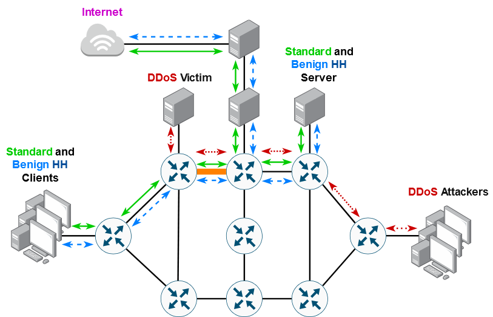
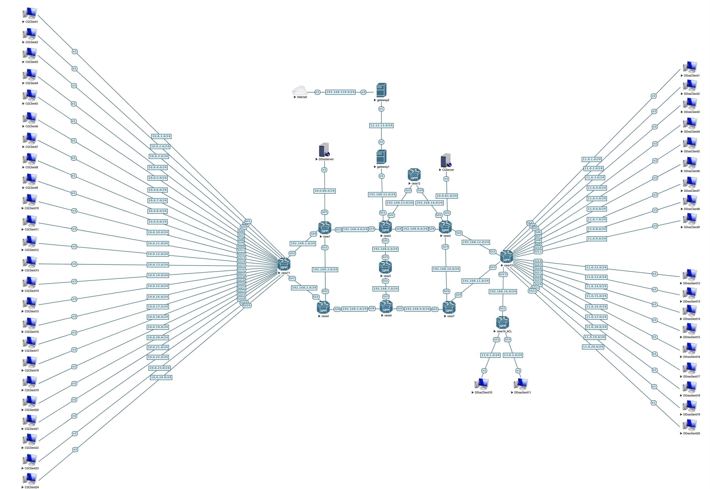
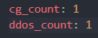
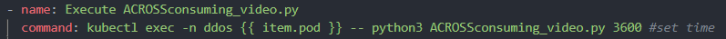
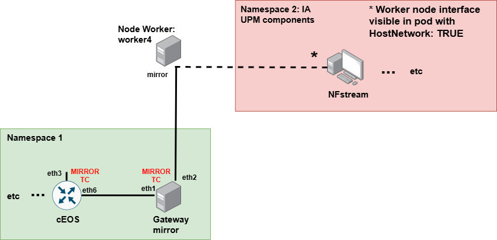

# Deployment of setup for Test Case 3.5 (Traffic Generation)

##  Deploy Topology

To proceed with the next steps, you should have a functional Kubernetes cluster with KNE installed and operational for topology creation. For detailed installation instructions, please refer to the official guide in the repository [KNE](https://github.com/openconfig/kne/blob/main/docs/setup.md)

#### 1. Clone this repository from the cluster controller:
```
 git clone <repository-url>
```
#### 2. Install Ansible:
Using Ansible we have automated the deployment of the scenario. Therefore, You must have Ansible is already installed inside the machine where you want to deploy the topology If this is not the case:
```
 sudo apt install ansible
```
#### 3. To deploy of the topology execute the `mw-deployment.yaml` file using the following command:
```
 ansible-playbook deployment-kne/mw-deployment.yaml  
```
> **Note:**  
> 1. It is necessary to load the images of the clients and routers previously in the machine where the topology will be deployed.
> 2. In the TC3.5_topology/10ceos_24cg_20dd_10ceos_rev4/pod-gateway2.yaml file, to enable internet access, we are connecting the pod to its host's interface. You need
to modify the interface name accordingly, depending on which interface you want to connect to. 

#### 4. To configure the pods in the topology execute the `mw-config.yaml` file using the following command:
```
ansible-playbook deployment-kne/mw-config.yaml  
```
#### 5. To execute of tasks `mw-tasks.yaml` file using the following command:
```
ansible-playbook deployment-kne/mw-tasks.yaml
```
#### 6. To delete of the topology execute the `mw-undeployment.yaml` file using the following command:
```
ansible-playbook deployment-kne/mw-undeployment.yaml  
```


Throughout the document, we will describe the way of using the different playbooks created. This will allow us to deploy the scenario (__mw-deployment.yaml__),configure the pods (__mw-config.yaml__), delete them (__mw-undeployment.yaml__) and execute tasks (__mw-tasks.yaml__). With this, we can easily **scale** the number of pods (__clients_number.yaml__) that we are going to deploy for different experiments. We can also decide the programs and scripts that we want to run as well as the execution time and other options.

## Scenario
Concept:


Topology:

## Usage

> **Note:** 
> With the script developed in python called **mw-run.py** it will allow us to run the playbooks in a guided and descriptive way. For greater customization, you can run the playbooks manually as described in the following sections.

### - clients_number.yaml
The first thing to do is adjust in this file the number of clients that we want to deploy for traffic generation (**ddosclient** and **cgclient**). This file will be used by the different playbooks to display the exact number of clients:

We can deploy two types of clients depending on the traffic we want to generate in the experiment:
- Simulation of Elephant and Cheetah Network Flows (**cg_count**)
- Simulation of a Variety of DDoS Attacks (**ddos_count**)




> **Note:** 
> Currently the topology configuration has support for 24 cgclients and 20 ddosclients.

### - mw-deployment.yaml

Inside the playbook we run the configuration file that Kne uses to create the topology through which the traffic will pass. This brings up all the routers following the topology built in EVE-NG.

> **Note:** 
> In this file you must configure the path where the kne topology file is (kne create <path_to_kne_file>). Currently is configured with the following path: ~/NDT_TC3.5_topology/10ceos_24cg_20dd_10ceos_rev4_mitigation/topology-ACROSS.yaml

### - mw-config.yaml

With this playbook we configure the different pods according to the number requested in the __clients_number.yaml__ file.

Inside the file also we configure the different routes of the **topology** through which all the traffic generated will pass as well as the different environment variables for the operation of the programs. When the deployment playbook is finished, all the scenario is configured and ready to play tasks.

> **Note:** 
> If we want to collect .pcaps inside the pods, we can activate them in the last section of the playbook called **tcpdump**. It is important to note that the **size** of data collected in these .pcaps is quite large, so the storage must be prepared to store them.
For more debug options in the deploymets with Ansible add: "<set_command> 2>&1 | tee /dev/tty"

### - mw-tasks.yaml

In this file we have to declare the differents programms/scripts that we are going to execute in the pods generated. Inside the file you can comment with **#** the tasks that you don't want to be executed. You can also configure the execution time of each task and other options:



More details about the scripts [here](docs/README.md)

### - mw-undeploy.yaml

When we run this playbook, we will store all the **logs** generated by the different programs within our host machine. Once the information is stored, the entire deployment will be completely deleted.

> **Note:** 
> All logs generated in the pods will be saved in the ~/NDT path of the host. This path is a mount point that is connected to an NFS (Network File System) server with the IP address 192.168.159.137 and the remote path /mnt/nfs/NDT.


### Traffic Flow Extraction to the AI Module:
> To redirect traffic flows from the topology to the AI module, a dummy interface is created on the worker node to serve as a mirror port:
```
sudo ip link add name mirror type dummy
sudo ip link set mirror up  
```

> Then, deploy the mirroring service by applying the mw-mirror.yaml file:
```
ansible-playbook deployment-kne/mw-mirror.yaml
```
The following image describes the process:


### Traffic Generators details
See extra [documentation](docs/README.md) for more details about generators in clients [docs](docs/README.md)
