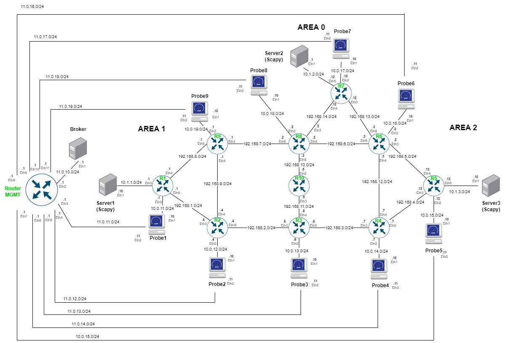

# ACROSS
Scenario for TC3.1, TC3.3 &amp; TC3.4

- TC3.1 Anticipatory Detection, Analysis, & Prevention of Congestion Problems
- TC3.3 Smart QoS-aware Zero-Touch Traffic Engineering
- TC3.4 Intelligent Zero-Touch SLA Preservation

An example of how to create a topology using the `10csr.yaml` descriptor is shown below:



- Create the 10 routers csr topology:
   
```bash
kne create kne/examples/cisco/13csr_RSTI/13csr.yaml
```

- Delete the scenario:
```bash
kne delete  kne/examples/cisco/13csr_RSTI/13csr.yaml
```

- See the status of the pods:
```bash
kubectl get pods -A -o wide -w
```

Once the topology has been successfully deloyed, the device created with vrnetlab can be accessed with the default credentials, corresponding to the user and password, "vrnetlab" and "VR-netlab9" respectively and its external IP address.

- Identify the External-IP: 

```bash
root@k8-controller:~# kubectl get services -n 13-csr
NAME          TYPE           CLUSTER-IP       EXTERNAL-IP   PORT(S)                      AGE
service-r1    LoadBalancer   10.101.108.17    172.18.0.53   22:32305/TCP,830:32420/TCP   6m4s
service-r10   LoadBalancer   10.99.54.39      172.18.0.59   22:30122/TCP,830:31624/TCP   6m
service-r11   LoadBalancer   10.99.71.178     172.18.0.51   830:31995/TCP,22:30196/TCP   6m5s
service-r12   LoadBalancer   10.104.126.184   172.18.0.56   22:30197/TCP,830:31175/TCP   6m2s
service-r13   LoadBalancer   10.111.24.237    172.18.0.54   22:30916/TCP,830:31724/TCP   6m3s
service-r2    LoadBalancer   10.105.44.34     172.18.0.55   22:31207/TCP,830:30341/TCP   6m2s
service-r3    LoadBalancer   10.108.142.7     172.18.0.60   22:31962/TCP,830:31661/TCP   5m59s
service-r4    LoadBalancer   10.98.149.41     172.18.0.61   830:30432/TCP,22:30630/TCP   5m58s
service-r5    LoadBalancer   10.106.48.244    172.18.0.52   22:30717/TCP,830:31649/TCP   6m5s
service-r6    LoadBalancer   10.101.200.167   172.18.0.50   22:31456/TCP,830:32107/TCP   6m5s
service-r7    LoadBalancer   10.106.192.53    172.18.0.57   22:30534/TCP,830:30642/TCP   6m1s
service-r8    LoadBalancer   10.97.189.65     172.18.0.62   22:32642/TCP,830:32498/TCP   5m57s
service-r9    LoadBalancer   10.102.85.108    172.18.0.58   22:32289/TCP,830:30217/TCP   6m
```

- Access to the router:

```bash
ssh vrnetlab@172.18.0.58
Password: VR-netlab9
```
- Start ssh in the server and client containers

```bash
kubectl -n 13-csr exec -it server1 -- service ssh start
kubectl -n 13-csr exec -it server2 -- service ssh start
kubectl -n 13-csr exec -it server3 -- service ssh start
kubectl -n 13-csr exec -it server4 -- service ssh start
kubectl -n 13-csr exec -it server5 -- service ssh start

kubectl -n 13-csr exec -it client1 -- service ssh start
kubectl -n 13-csr exec -it client2 -- service ssh start
kubectl -n 13-csr exec -it client3 -- service ssh start
kubectl -n 13-csr exec -it client4 -- service ssh start
kubectl -n 13-csr exec -it client5 -- service ssh start
```
