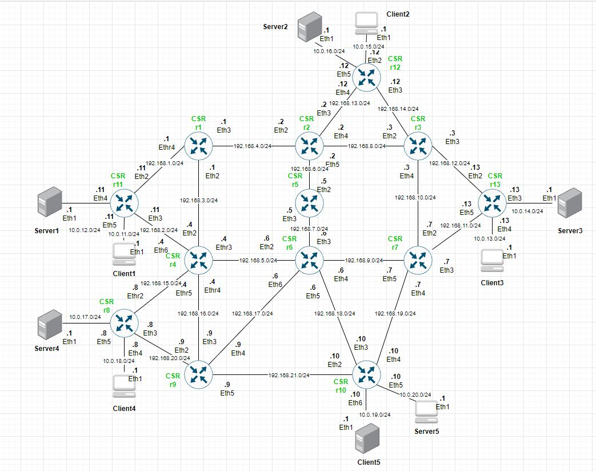

# ACROSS
Scenario for TC3.1, TC3.3 &amp; TC3.4

TC3.1 Anticipatory Detection, Analysis, & Prevention of Congestion Problems
TC3.3 Smart QoS-aware Zero-Touch Traffic Engineering
TC3.4 Intelligent Zero-Touch SLA Preservation

An example of how to create a topology using the `10csr.yaml` descriptor is shown below:

